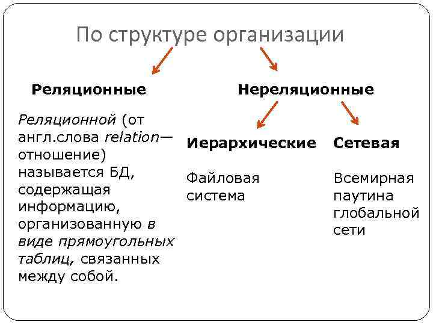
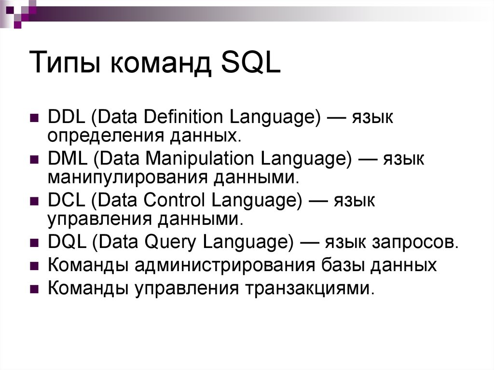
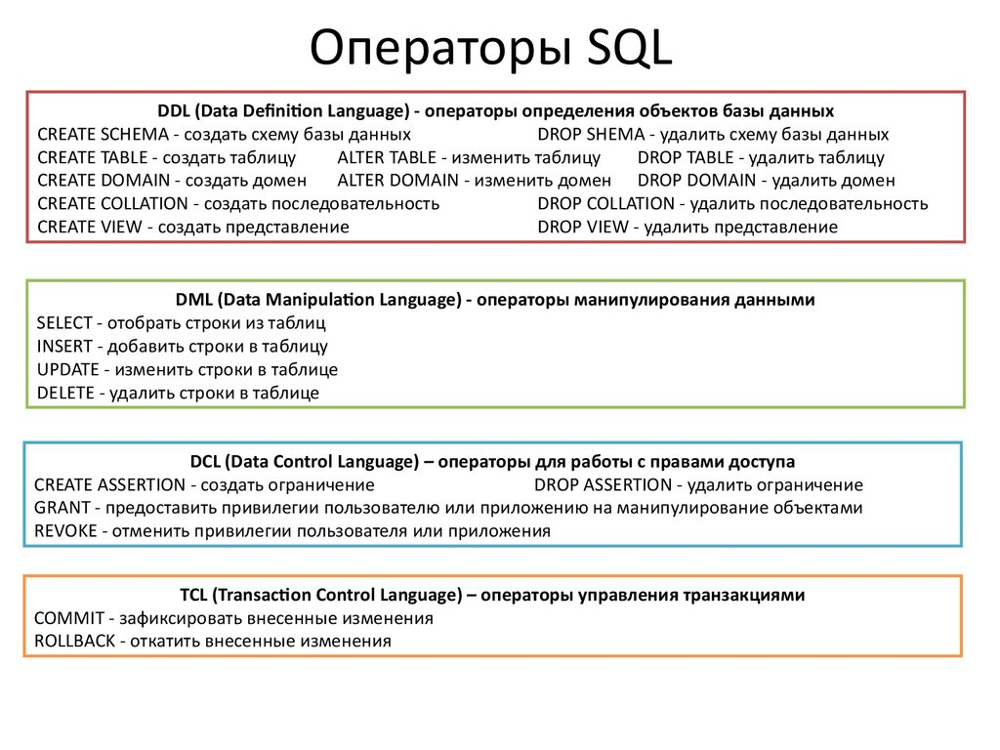
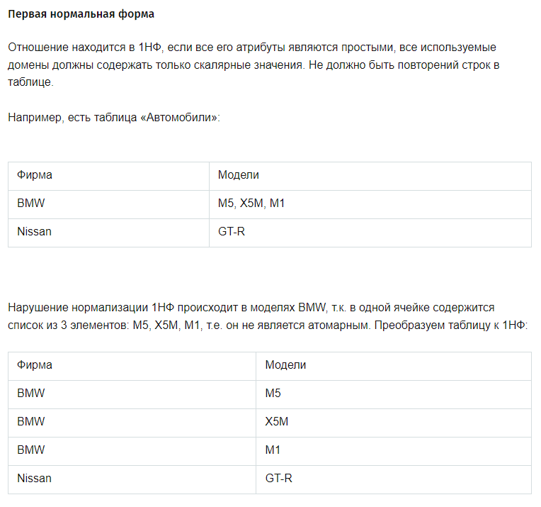
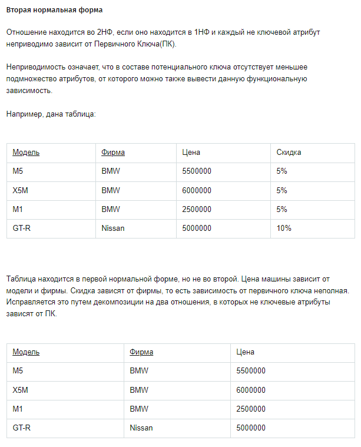
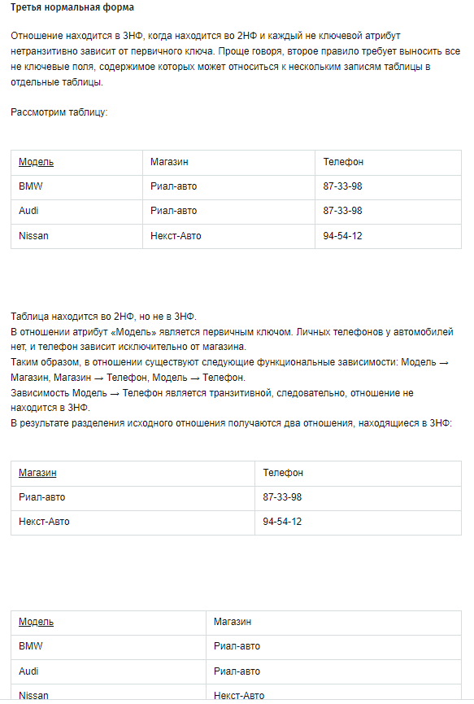
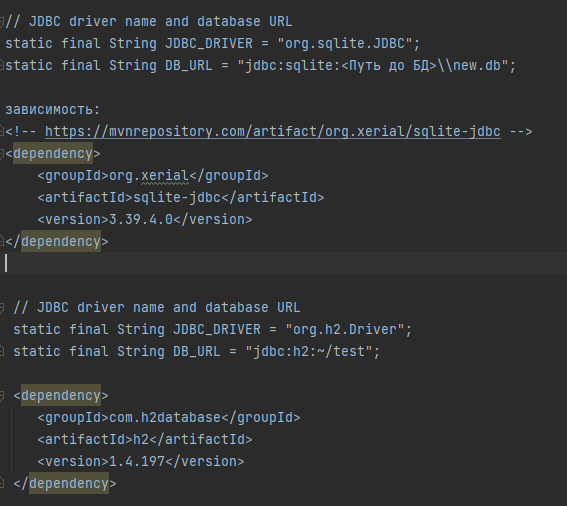
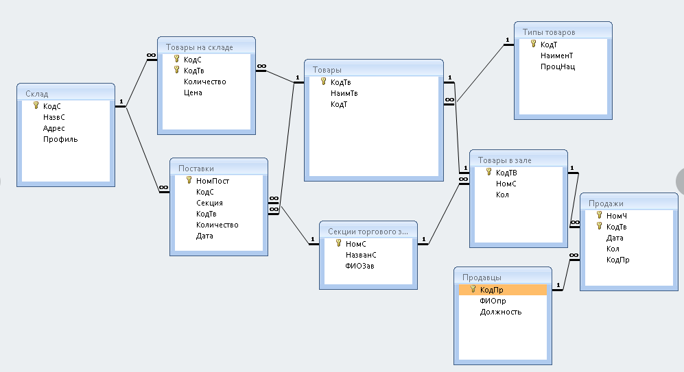
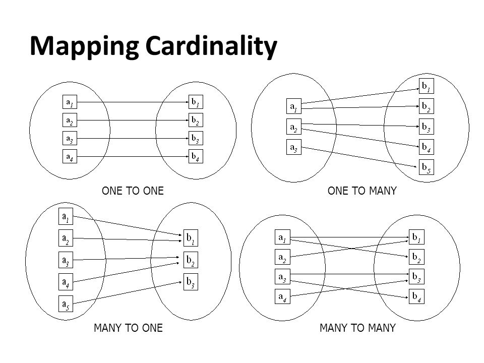
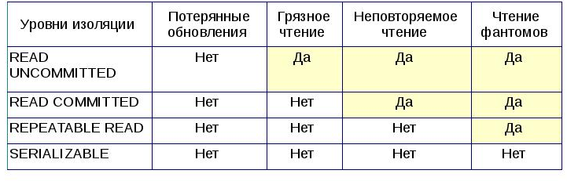

Реляционная база данных – это набор данных с предопределенными связями между ними.

Нереляционная база данных — это база данных, в которой в отличие от большинства традиционных систем баз данных не используется табличная схема строк и столбцов.

Наиболее популярные БД: MySql, PostgreSQL, MongoBD  

Ключевые определения:
Индексы - это наборы уникальных значений для некоторой таблицы с соответствующими ссылками на данные. 

**Виды (типы) индексов в MySQL**
- Первичный ключ (PRIMARY KEY) – это основной ключ, который в таблице может быть только один. Он позволяет идентифицировать уникальные записи в таблице. Значения, которые находятся в столбце, где поля имеют PRIMARY KEY, не могут повторяться. Нередко первичный ключ назначают для полей с идентификатором id.

- Уникальный ключ (UNIQUE) – по сути, это альтернатива первичному ключу: значения, которые содержатся в таких полях также не могут повторяться и иметь значение NULL.

- Составной индекс – позволяет включать в индекс несколько полей, по которым часто происходит выборка. Например, если в условиях часто фигурирует два параметра:
SELECT username FROM users WHERE city = '5' AND age > '18'
При использовании таких запросов составной индекс по полям city и age поможет ускорить выборку данных.

**Недостатки использования индексов:**

За все приходится платить, не исключение и индексы в MySQL. В процессе индексирования MySQL создает дополнительные таблицы, в которых хранятся отсортированные данные. Однако, в большинстве случаев выгоды от быстродействия более ощутимы, чем издержки физической памяти.
Запросы на вставку данных в таблицу выполняются чуть дольше, поскольку MySQL требуется создать новые индексы и реорганизовать данные в предназначенных для этого таблицах. Но поскольку запросы на вставку выполняются реже, чем на извлечение данных, то серьезных потерь это обычно не приносит.

Нормальная форма — требование, предъявляемое к структуре таблиц в теории реляционных баз данных для устранения из базы избыточных функциональных зависимостей между атрибутами (полями таблиц).

COUNT - вычисляет количество найденых строк;
SUM - находит сумму значений в найденых строках;
MAX - находит найбольшее среди найденых значений;
MIN - находит наименьшее среди найденых значений;
AVG - находит среднее значение от найденых

Примеры команд SQL:
SHOW DATABASES;
SHOW TABLES;
CREATE DATABASE student
USE student

SELECT * FROM <имя базы данных>
INSERT INTO <имя баз данных>(поле1,поле2,поле3) VALUES (<значение1>,<значение2>,<значение3>)
SELECT name FROM student  WHERE name LIKE 'Jo%n';
SELECT COUNT (name) FROM student
SELECT name, surname FROM student WHERE name = "Ivan";

Выборка данных из двух таблиц:
SELECT DISTINCT y.project_name, y.description, COUNT(x.name), FROM staff x, projects yWHERE
y.project_name = x.project AND
y.project_name > 'Secret data' AND
y.project_name LIKE "Wo__d%"
ORDER BY
project_name;

JDBC (англ. Java DataBase Connectivity — соединение с базами данных на Java) — платформенно независимый промышленный стандарт взаимодействия Java-приложений с различными СУБД, реализованный в виде пакета java.sql, входящего в состав Java SE.

Пример соединения с БД:

    public static void main(String[] args) {
        try {
            Class.forName("org.sqlite.JDBC");
            String dbURL = "jdbc:sqlite:product.db";
            Connection conn = DriverManager.getConnection(dbURL);
            if (conn != null) {
                System.out.println("Connected to the database");
                DatabaseMetaData dm = (DatabaseMetaData) conn.getMetaData();
                System.out.println("Driver name: " + dm.getDriverName());
                System.out.println("Driver version: " + dm.getDriverVersion());
                System.out.println("Product name: " + dm.getDatabaseProductName());
                System.out.println("Product version: " + dm.getDatabaseProductVersion());
                conn.close();
            }
        } catch (ClassNotFoundException ex) {
            ex.printStackTrace();
        } catch (SQLException ex) {
            ex.printStackTrace();
        }
    }

Отношения между сущностями. Вариантов всего четыре:

OneToOne - один к одному

OneToMany - один ко многим

ManyToOne - многие к одному

ManyToMany - многие ко многим

Уровни изоляции транзакции:

Пример описания уровней изоляции транзакции:
https://habr.com/ru/post/469415/?ysclid=laiax2vip198428143

Hibernate — библиотека для языка программирования Java, предназначенная для решения задач объектно-реляционного отображения (ORM), самая популярная реализация спецификации JPA. Распространяется свободно на условиях GNU Lesser General Public License.

Позволяет сократить объёмы низкоуровневого программирования при работе с реляционными базами данных; может использоваться как в процессе проектирования системы классов и таблиц «с нуля», так и для работы с уже существующей базой.

Библиотека не только решает задачу связи классов Java с таблицами базы данных (и типов данных Java с типами данных SQL), но и также предоставляет средства для автоматической генерации и обновления набора таблиц, построения запросов и обработки полученных данных и может значительно уменьшить время разработки, которое обычно тратится на ручное написание SQL- и JDBC-кода. Hibernate автоматизирует генерацию SQL-запросов и освобождает разработчика от ручной обработки результирующего набора данных и преобразования объектов, максимально облегчая перенос (портирование) приложения на любые базы данных SQL.

ORM — (англ. Object-relational mapping). В двух словах ORM — это отображение объектов какого-либо объектно-ориентированного языка в структуры реляционных баз данных. Именно объектов, таких, какие они есть, со всеми полями, значениями, отношениями м/у друг другом
