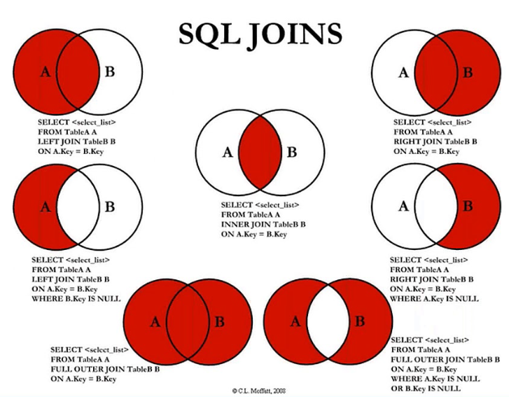

Реляционная база данных – это набор данных с предопределенными связями между ними.
Нереляционная база данных — это база данных, в которой в отличие от большинства традиционных систем баз данных не используется табличная схема строк и столбцов.

Индексы - это наборы уникальных значений для некоторой таблицы с соответствующими ссылками на данные. 

**Виды (типы) индексов в MySQL**
- Первичный ключ (PRIMARY KEY) – это основной ключ, который в таблице может быть только один. Он позволяет идентифицировать уникальные записи в таблице. Значения, которые находятся в столбце, где поля имеют PRIMARY KEY, не могут повторяться. Нередко первичный ключ назначают для полей с идентификатором id.

- Уникальный ключ (UNIQUE) – по сути, это альтернатива первичному ключу: значения, которые содержатся в таких полях также не могут повторяться и иметь значение NULL.

- Составной индекс – позволяет включать в индекс несколько полей, по которым часто происходит выборка. Например, если в условиях часто фигурирует два параметра:
SELECT username FROM users WHERE city = '5' AND age > '18'
При использовании таких запросов составной индекс по полям city и age поможет ускорить выборку данных.

**Недостатки использования индексов:**

За все приходится платить, не исключение и индексы в MySQL. В процессе индексирования MySQL создает дополнительные таблицы, в которых хранятся отсортированные данные. Однако, в большинстве случаев выгоды от быстродействия более ощутимы, чем издержки физической памяти.
Запросы на вставку данных в таблицу выполняются чуть дольше, поскольку MySQL требуется создать новые индексы и реорганизовать данные в предназначенных для этого таблицах. Но поскольку запросы на вставку выполняются реже, чем на извлечение данных, то серьезных потерь это обычно не приносит.

Нормальная форма — требование, предъявляемое к структуре таблиц в теории реляционных баз данных для устранения из базы избыточных функциональных зависимостей между атрибутами (полями таблиц).

JDBC (англ. Java DataBase Connectivity — соединение с базами данных на Java) — платформенно независимый промышленный стандарт взаимодействия Java-приложений с различными СУБД, реализованный в виде пакета java.sql, входящего в состав Java SE.